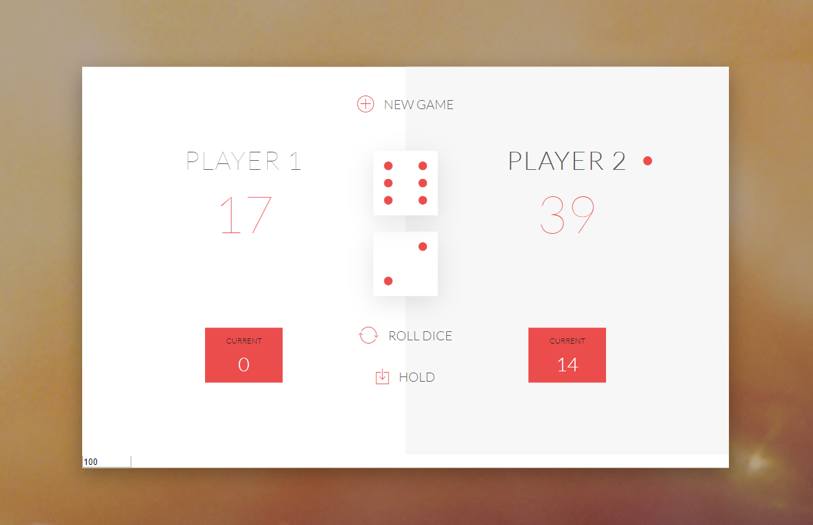
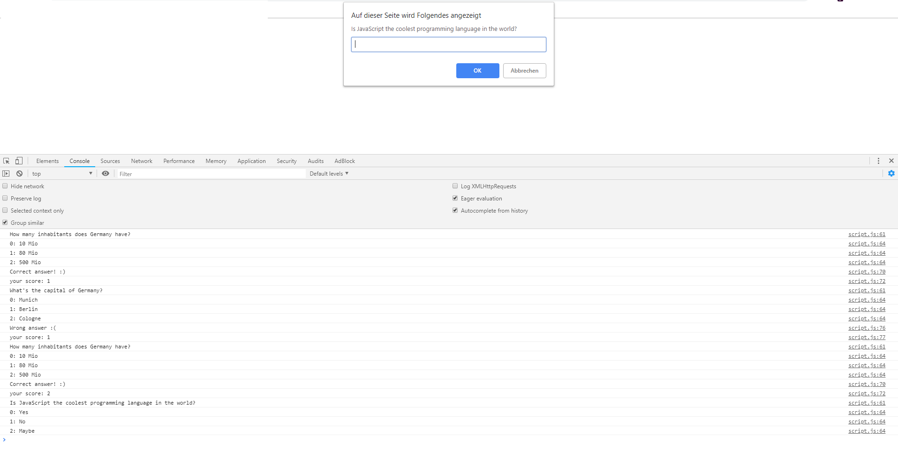

# First steps in JavaScript

These are my first projects, where I put all the stuff together I've learned in my *Udemy* JavaScript Course.

My Udemy Course: [*The Complete JavaScript Course 2019: Build Real Projects*](https://www.udemy.com/the-complete-javascript-course/learn/v4/content) 
by Jonas Schmedtmann

## Projects

### 01 pig game

This small dice game marks my first steps with DOM manipulation, eventListeners and HTML/CSS. Initial CSS file was provided by the teacher. 

By rolling the dice a player collects points, can store the current points to his global score and try to win the game before the other player hits the limit of 100 points.
Later on it gets a little more difficult by adding a second dice and more rules, so there is a higher possibility to lose your score. At least the limit points can be changed by yourself.

### 02 console quiz

I learned my first object stuff and tried to reflect it in this small console quiz. 

By choosing a multiple choice answer of a question, which is shown in the promptWindow and the console, you can collect points for your score in case your answer is correct. The game can be interrupted by writing "exit" in the promptWindow. 

**Author: Evelyn Grätz [@Brezelfrau](https://github.com/Brezelfrau)**